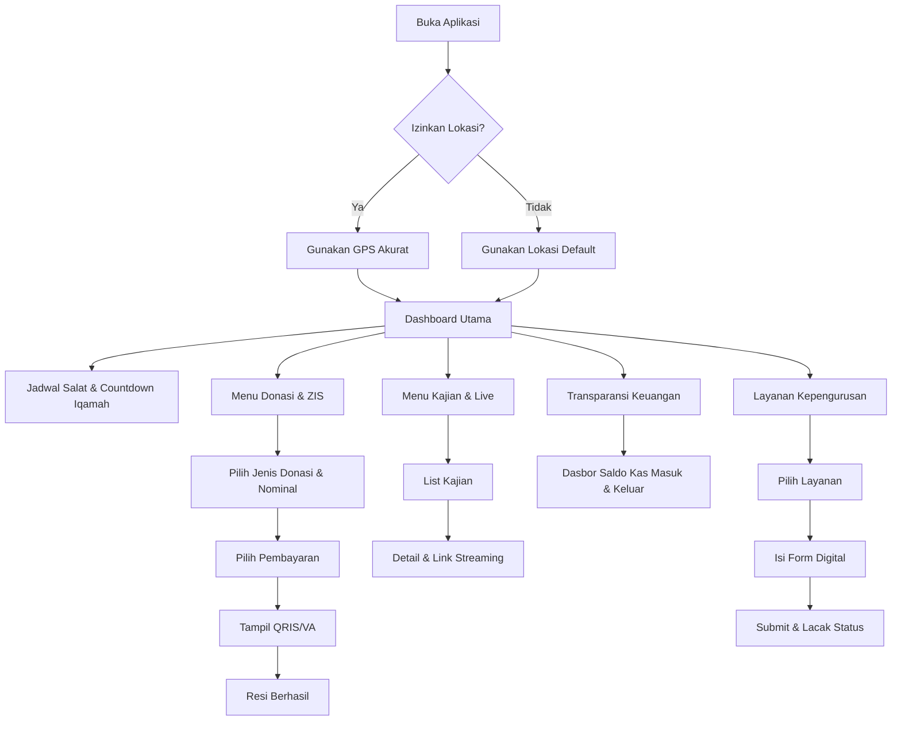

# Product Requirements Document (PRD): Aplikasi Mobile Masjid Haqqul Yaqin

## 1. Pendahuluan
Aplikasi mobile Masjid Haqqul Yaqin bertujuan untuk memudahkan jemaah dan masyarakat dalam mengakses informasi masjid, jadwal ibadah, serta layanan sosial dan kepengurusan secara digital. Aplikasi ini akan menjadi pusat interaksi digital yang modern, interaktif, dan transparan bagi jemaah.

## 2. Core Features (Fitur Utama)
1. **Jadwal Salat & Waktu Imsakiyah**: 
   - Pengingat waktu salat akurat berdasarkan lokasi *real-time*.
   - Hitung mundur (*countdown*) menuju waktu iqamah.
2. **Donasi & Infaq Online (ZIS)**: 
   - Payment gateway terintegrasi untuk sedekah, zakat, dan wakaf (Transfer Bank, E-Wallet, QRIS).
   - Laporan donasi pribadi dan notifikasi transaksi berhasil.
3. **Manajemen Kajian & Pengajian**: 
   - Kalender digital kajian memuat nama ustaz, tema ceramah, dan jadwal.
   - Tautan *live streaming* (YouTube/Zoom) bagi jemaah yang berhalangan hadir.
4. **Laporan Keuangan Transparan**: 
   - Dasbor publik yang memuat rincian kas masuk/keluar, saldo infaq, dan laporan operasional secara real-time.
5. **Pusat Informasi & Pengumuman**: 
   - Jadwal piket imam/muadzin, tata tertib masjid, dan informasi kegiatan sosial masyarakat.
6. **Layanan Kepengurusan**: 
   - Formulir digital terpadu untuk pendaftaran mualaf, pengurusan jenazah, pernikahan, hingga permohonan penggunaan fasilitas/aula.
7. **Direktori Digital Masjid**: 
   - Peta lokasi strategis dan informasi fasilitas yang tersedia untuk memudahkan musafir.

## 3. App Flow (Alur Aplikasi)
- **Onboarding**: Saat pertama kali dibuka, aplikasi meminta izin lokasi (untuk akurasi jadwal salat) dan izin notifikasi (untuk pengingat azan/iqamah).
- **Home/Dashboard**: Halaman beranda langsung menyajikan **Jadwal Salat & Hitung Mundur Iqamah** di bagian paling atas. Di bawahnya, terdapat menu pintasan (*quick actions*) untuk Donasi, Kajian, dan Layanan.
- **ZIS/Donasi Flow**: Pengguna menekan tombol Donasi -> Memilih peruntukan (Infaq operasional, Yatim, Pembangunan, dll) -> Memasukkan nominal -> Memilih metode pembayaran (misal: QRIS) -> Layar memunculkan QR Code -> Pengguna membayar lewat aplikasi e-wallet mereka -> Aplikasi menampilkan resi sukses.
- **Kajian Flow**: Pengguna membuka menu Kajian -> Melihat daftar jadwal bulanan/mingguan -> Mengklik salah satu jadwal untuk melihat deskripsi lengkap atau langsung menekan tombol *Live Streaming*.
- **Transparansi Flow**: Pengguna masuk ke menu Keuangan -> Melihat grafik sederhana atau tabel ringkas kas bulan berjalan -> Bisa mengunduh PDF laporan jika dibutuhkan.
- **Layanan Flow**: Pengguna memilih menu Layanan (misal: Penggunaan Aula) -> Mengisi formulir pendaftaran digital -> *Submit* -> Menerima nomor tiket pengajuan dan status apakah sudah disetujui admin.

## 4. Mermaid Flow Chart



## 5. ASCII Wireframe (Tampilan Mobile)

```text
+-----------------------------------+
| 12:00                    [4G] [B] |
+-----------------------------------+
|       MASJID HAQQUL YAQIN         |
|         [Ikon Profil]             |
+-----------------------------------+
|  [ Lokasi: Jakarta Selatan ]      |
|  Dzuhur  : 12:05                  |
|  *Iqamah berkumandang dalam: 10m* |
|  Ashar   : 15:20                  |
+-----------------------------------+
|  +-------+ +-------+ +-------+    |
|  | Donasi| | Kajian| | Lapor |    |
|  +-------+ +-------+ +-------+    |
|  +-------+ +-------+ +-------+    |
|  |Layanan| | Info  | |  Peta |    |
|  +-------+ +-------+ +-------+    |
+-----------------------------------+
| === KEUANGAN MASJID BULAN INI === |
| Total Saldo: Rp 15.000.000        |
| [+] Kas Masuk: Rp 5.000.000       |
| [-] Kas Keluar: Rp 2.000.000      |
|         [Lihat Detail]            |
+-----------------------------------+
| === KAJIAN TERDEKAT ===           |
| [Ust. Fulan - Tafsir - 18.30]     |
| [🔴 NONTON LIVE STREAMING]        |
+-----------------------------------+
| [Beranda]   [Jadwal]   [Akun]     |
+-----------------------------------+
```

## 6. Backend API & Database Schema Plan

### A. Teknologi yang Digunakan
- **Framework:** Express.js
- **Database:** PostgreSQL
- **ORM:** Drizzle ORM
- **Authentication:** Better Auth (mengatur user, session, dan integrasi mudah)
- **Arsitektur:** Controller -> Service -> Repository (Pemisahan *business logic* dan *routing*)

### B. Database Schema (Drizzle ORM)

```typescript
// 1. Users (Dikelola oleh Better Auth, dengan tambahan custom fields)
export const users = pgTable('user', {
  id: text('id').primaryKey(),
  name: text('name').notNull(),
  email: text('email').notNull().unique(),
  emailVerified: boolean('emailVerified').notNull(),
  image: text('image'),
  role: text('role').notNull().default('jamaah'), // 'jamaah', 'admin'
  createdAt: timestamp('createdAt').notNull(),
  updatedAt: timestamp('updatedAt').notNull()
});

// (Tabel session & account milik Better Auth tidak dijabarkan secara rinci di sini)

// 2. Donations / ZIS
export const donations = pgTable('donations', {
  id: serial('id').primaryKey(),
  userId: text('user_id').references(() => users.id), // Bisa null untuk hamba Allah (Anonim)
  type: text('type').notNull(), // 'infaq', 'zakat', 'wakaf'
  amount: decimal('amount').notNull(),
  paymentMethod: text('payment_method').notNull(), // 'qris', 'transfer_bank'
  status: text('status').notNull().default('pending'), // 'pending', 'success', 'failed'
  createdAt: timestamp('created_at').defaultNow()
});

// 3. Kajian
export const kajian = pgTable('kajian', {
  id: serial('id').primaryKey(),
  title: text('title').notNull(),
  ustadzName: text('ustadz_name').notNull(),
  description: text('description'),
  scheduledAt: timestamp('scheduled_at').notNull(),
  liveStreamUrl: text('live_stream_url'), // Link YouTube/Zoom
  createdAt: timestamp('created_at').defaultNow()
});

// 4. Finances (Keuangan)
export const finances = pgTable('finances', {
  id: serial('id').primaryKey(),
  type: text('type').notNull(), // 'income', 'expense'
  category: text('category').notNull(), // misal: 'operasional', 'pembangunan', 'infaq_jumat'
  amount: decimal('amount').notNull(),
  description: text('description'),
  date: timestamp('date').notNull(),
  createdAt: timestamp('created_at').defaultNow()
});

// 5. Services (Layanan Kepengurusan)
export const services = pgTable('services', {
  id: serial('id').primaryKey(),
  userId: text('user_id').references(() => users.id).notNull(),
  serviceType: text('service_type').notNull(), // 'mualaf', 'jenazah', 'nikah', 'aula'
  formData: jsonb('form_data').notNull(), // Data spesifik per layanan disimpan dinamis
  status: text('status').notNull().default('pending'), // 'pending', 'approved', 'rejected'
  createdAt: timestamp('created_at').defaultNow()
});
```

### C. API Routes & Service Separation Plan

*Routing* hanya berfungsi menangani request/response HTTP. Logika aplikasi didelegasikan ke *Service layer*.

**1. Auth Routes** (`/api/auth/*`)
- Dikelola otomatis oleh Better Auth (*login, register, session management*).

**2. Donations Routes** (`/api/donations`)
- `POST /` -> Memanggil `DonationService.createDonation(req.body)`
- `GET /` -> Memanggil `DonationService.getAllDonations(req.query)`
- `POST /webhook` -> Memanggil `DonationService.handlePaymentWebhook(req.body)` *(dipanggil otomatis oleh payment gateway untuk update status `pending` menjadi `success`)*

**3. Kajian Routes** (`/api/kajian`)
- `GET /` -> Memanggil `KajianService.getUpcomingKajian()`
- `POST /` -> Memanggil `KajianService.createKajian(req.body)` *(Admin Only)*

**4. Finances Routes** (`/api/finances`)
- `GET /summary` -> Memanggil `FinanceService.getFinanceSummary()` *(Mengembalikan total saldo, kas masuk, kas keluar untuk Dashboard real-time)*
- `GET /` -> Memanggil `FinanceService.getFinanceReports(req.query)`
- `POST /` -> Memanggil `FinanceService.recordTransaction(req.body)` *(Admin Only)*

**5. Services Routes** (`/api/services`)
- `POST /` -> Memanggil `ServiceRequestService.createRequest(req.body, req.user)` *(Jemaah mendaftar layanan)*
- `GET /my-requests` -> Memanggil `ServiceRequestService.getUserRequests(req.user)`
- `PATCH /:id/status` -> Memanggil `ServiceRequestService.updateRequestStatus(req.params.id, req.body)` *(Admin Only: mengubah status dari pending ke approved)*

### D. Development Environment
- Menyediakan `docker-compose.yml` untuk men-setup PostgreSQL database secara lokal khusus untuk *development*.
- Menyesuaikan file `.env.example` yang mencakup *default credentials* dan variabel lain agar mempermudah instalasi.

## 7. Frontend Architecture & Integration Plan
- **Framework & State Management:** React (dengan Vite).
- **Data Fetching:** Menggunakan **Tanstack Query** (React Query) untuk manajemen *server state*, *caching*, dan sinkronisasi data yang efisien.
- **Authentication:** Menggunakan **Better Auth React Client** untuk menangani otentikasi di sisi Frontend.
- **Client Service Separation:** Memisahkan seluruh panggilan API (endpoint) ke dalam file layanan *client* yang terisolasi per fitur (misal: `api/donations.ts`, `api/kajian.ts`) untuk kemudahan *reusability*.
- **Custom Hooks Integration:** Membuat *custom hooks* pembungkus Tanstack Query (misal: `useGetKajian()`, `useSubmitDonation()`) yang mengonsumsi *client service* tersebut, untuk kemudian diintegrasikan dan digunakan langsung pada halaman React Frontend (seperti pada App Dashboard).
